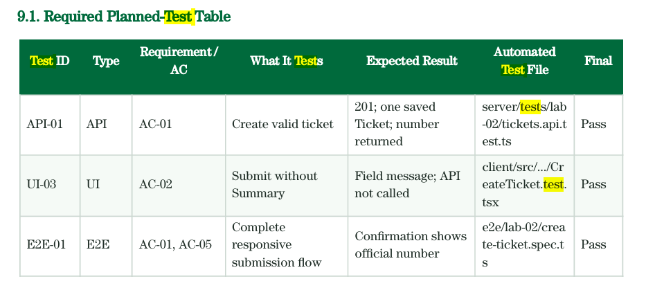

# Lab 2 — AI Use and Reflection

I used **Claude Code** with **Claude Opus 5**, run from the Claude Desktop app, the same setup as Lab 1. Two
behaviour plugins stayed active: *caveman*, which strips filler from the agent's prose, and *ponytail*, which
pushes it toward the smallest solution that works instead of scaffolding for features the lab does not have.

The working pattern was the same as Lab 1 and got shorter as the sprint went on: the specification, API spec,
UI spec, and test plan were written first and approved by review, so almost every implementation prompt could
be a single line naming the branch and pasting the Issue body. The agent read the specs itself.

## Selected Key Prompts

### Specification Agent

| Prompt Name | Actual Prompt Text |
|---|---|
| Assign the specification role | *You're Specification AI Agent who are specialized at transform stakeholder requests provided into the engineering contract until the requirements, business rules, acceptance criteria, and test scenarios are sufficiently detailed and complete before implementation begins. Your task: You're required to transform the given stakeholder request into engineering contract with the format of what is provided* (followed by the stakeholder request and the `specification.md` template) — *If you have any questions or found something ambiguity, you must raise questions here to let me know and clarify it before you start writing.* |
| | **My Reflection:** The last sentence did the real work. Without it I would have got a plausible specification with a dozen invented rules buried in it. Instead the agent read the repo first, then came back with seventeen questions grouped A–G — attachment storage, ticket-number format, how the requester context reaches the API, ownership `403` versus `404` — each with a proposed default so I could answer quickly. It wrote nothing until I answered. |
| Answer only what I chose to answer | *A1 — there is source material for this Lab and I have put in it here. You may read for further information, but I prefer to checking the requirement by myself for practice.* … *D10 Here is the limitation: Allowed types JPG/JPEG, PNG, WEBP, PDF · Maximum size 5 MB per file · Maximum active attachments five per Ticket · Removal must be implemented as soft removal · Removed files must not be downloadable or previewed.* … *You may the rest as default and I will check again.* |
| | **My Reflection:** I answered three of the seven groups and released the rest as defaults, which is the part I would repeat. Handing over the labsheet PDF but saying I would check the requirements myself kept the agent from treating the handout as the whole job. It also corrected two of its own defaults against the fixed constraints without being told — it had proposed `.txt` and `.docx` as permitted types, and dropped them once the real allowlist arrived. |
| Specify the test plan by image |  **Now I have checkout to new branch with new issue** https://github.com/GGital/TocktickIT/issues/13 — *You're now required to write tests.md that are containing the scenarios to prove business request and acceptance criteria written in @docs/lab-02/api-spec.md, @docs/lab-02/ui-spec.md, and @docs/lab-02/specification.md. Output format: Embedding image* |
| | **My Reflection:** Pasting the handout's own table as an image was faster than describing seven columns, and the output matched it exactly. The plan came back with 113 tests and, more usefully, a second traceability table for the eighteen business rules that no acceptance-criterion test would have caught. |
| Turn the contract into a backlog | *Now that you have details of all of the project's requirement I would like you to list the issues I should create with its deliverable* |
| | **My Reflection:** This is what closed the gap between the documents and GitHub. Thirteen Issues with branch names, dependencies, and the exact test IDs each one owns, so the Issue bodies became the implementation prompts later. It also flagged that one Issue depended on three others and offered a split.|

### Coding Agent
| Prompt Name | Actual Prompt Text |
|---|---|
| Frame the whole sprint | *Now, I would like you to be software engineer who received the engineer contract/specs from @docs/lab-02 that will be containing all of the acceptance criteria and business request. For the first work, you're require to complete this issue …* (followed by the Issue body and the desired final project structure) |
| | **My Reflection:** This is the prompt that made every later one short. Pointing at `docs/lab-02` as a contract, rather than describing the feature myself, meant the agent quoted BR and AC numbers back in code comments and test names. The "desired project structure" block was what kept file paths matching `tests.md` instead of drifting. |
| Per-issue implementation | *I have checkout to feat/lab2-create-ticket-api. Please complete this issue* (followed by the Issue's bullet list) |
| | **My Reflection:** Eight of the thirteen Issues were driven by this one shape. The bullets came straight from the GitHub Issue, so the agent's definition of done and the Issue's were literally the same text. It also meant I never had to re-explain the branching rule. |
| Ask for data to test with | *Could you add a ticket or a seed file to test the functionality of lab2-ticket-detail?* |
| | **My Reflection:** I wanted to click through the screen myself. The useful part of the answer was the refusal to put demo tickets into `prisma/seed.ts` — BR-46 says the seed creates no tickets, and API-04 snapshots it for idempotency — so it built a separate `npm run seed:demo` script instead. It then told me the screen still would not work because `GET /api/tickets/:id` did not exist yet, which I had not noticed. |
